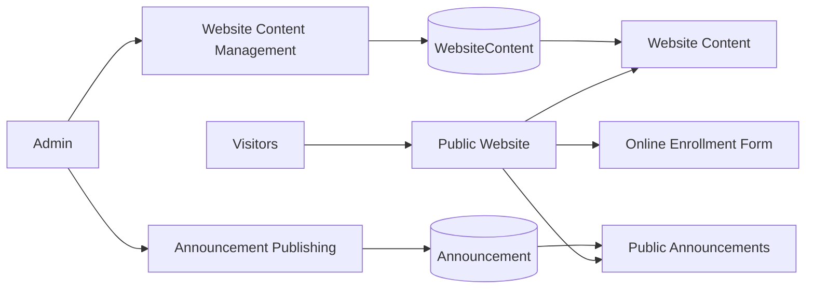
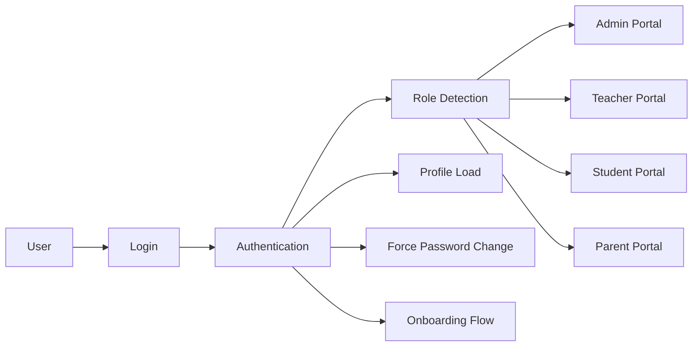
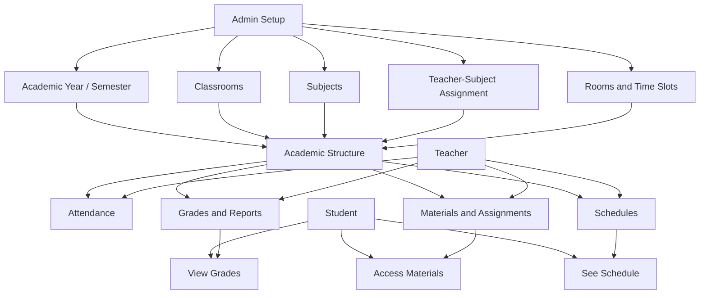
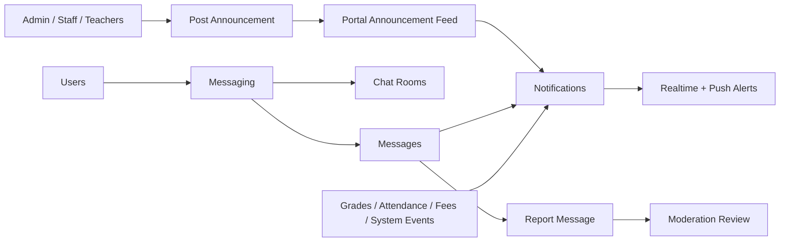
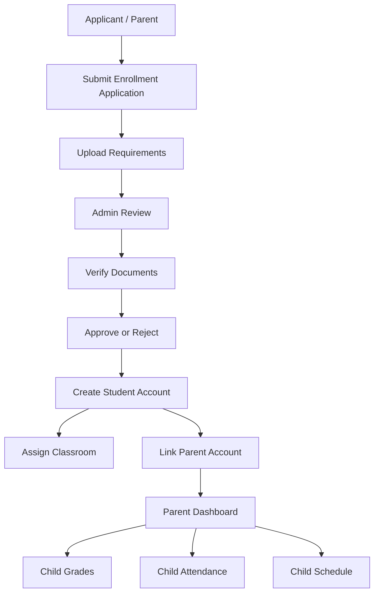
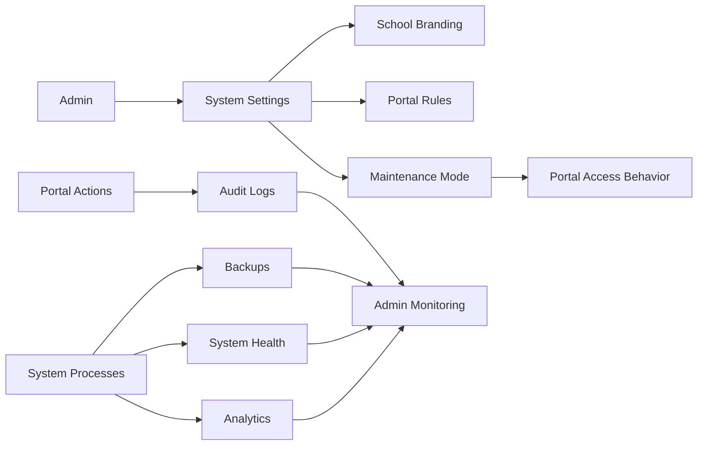
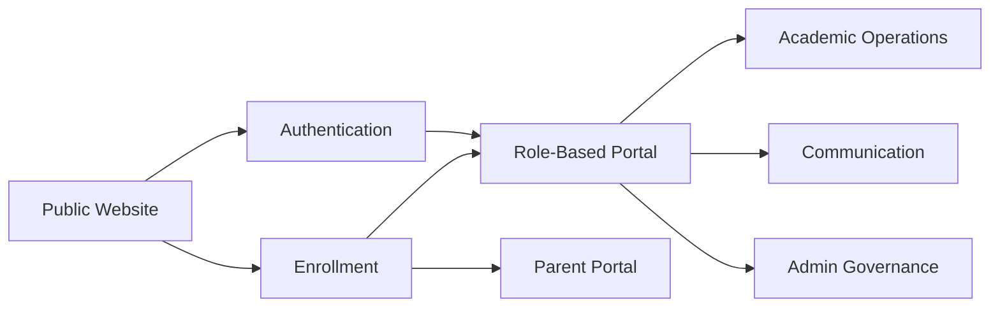

# Presentation-Friendly System Workflow Overview

This version is optimized for presentations, walkthroughs, and stakeholder reviews.

## Presentation Flow

1. Public-facing experience
2. User access and portal entry
3. Academic operations
4. Communication and engagement
5. Enrollment and parent visibility
6. Governance and system operations

---

## 1. Public-Facing Experience

### What This Covers

- Public website pages
- Website content management
- Public announcements
- Online enrollment entry point

### Workflow

### Key Message

The webapp starts as a public school website, then directs users into announcements, information pages, and enrollment.

---

## 2. User Access And Portal Entry

### What This Covers

- Login and authentication
- Role-based portal access
- Protected routes
- Password change and onboarding

### Workflow

### Key Message

The same login system branches users into the correct workspace based on their role and account state.

---

## 3. Academic Operations

### What This Covers

- Academic years and semesters
- Classrooms and subject assignment
- Attendance
- Grades and reports
- Materials, assignments, and submissions
- Scheduling

### Workflow

### Key Message

Academic setup is the foundation of the portal. Once classes, subjects, and schedules exist, the rest of the learning workflow becomes available.

---

## 4. Communication And Engagement

### What This Covers

- Announcements
- Notifications
- Messaging
- Friend requests
- Moderation and reporting

### Workflow

### Key Message

The communication layer keeps users informed through announcements, alerts, and direct messaging, while moderation keeps the environment safe.

---

## 5. Enrollment And Parent Visibility

### What This Covers

- Applicant journey
- Admin review workflow
- Student enrollment completion
- Parent linking and parent dashboard

### Workflow

### Key Message

Enrollment does not end at approval. It continues into account creation, classroom assignment, and parent visibility into the student journey.

---

## 6. Governance And System Operations

### What This Covers

- School settings
- Maintenance mode
- Audit logs
- Backups
- Analytics
- System health

### Workflow

### Key Message

These systems help administrators control the portal, monitor activity, protect data, and keep the platform stable.

---

## One-Slide Executive View

### Summary

- The public website attracts, informs, and receives applicants.
- Authentication moves each user into the correct role-based portal.
- Academic operations power teaching, grading, materials, and scheduling.
- Communication systems keep the school community connected.
- Enrollment connects applicants, students, classrooms, and parents.
- Governance systems keep the platform manageable and secure.

