# Full Webapp System Workflows

This document consolidates the main workflows implemented across the KNHS public website, portal, and admin systems into a single reference.

## System Map

- Public website and content management
- Authentication, access control, and onboarding
- User, teacher, student, and parent management
- Enrollment and admissions
- Academic setup, classrooms, and subject assignment
- Attendance
- Grades and reports
- Learning materials, assignments, and submissions
- Scheduling and calendars
- Announcements and comments
- Notifications and push delivery
- Messaging, friendships, and moderation
- Parent portal
- Settings, maintenance mode, and school configuration
- Audit logs, backups, analytics, and system health

---

## 1. Public Website And Content Management

### Workflow Summary

1. Visitor opens the public website.
2. Public pages load content such as home, about, programs, contact, news, calendar, and enrollment.
3. Public announcements and website content are fetched from the backend.
4. Admin updates website sections in Website Content Management.
5. Saved content is stored in `WebsiteContent` and reused by the public site.

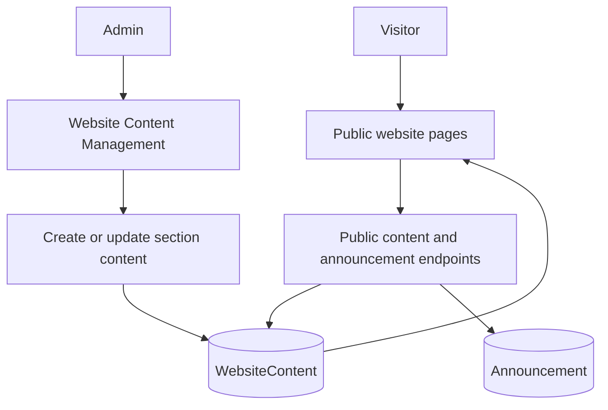

---

## 2. Authentication, Access Control, And Onboarding

### Workflow Summary

1. User signs in through the login page.
2. Backend validates credentials and returns portal access.
3. Frontend loads the user profile and role.
4. Protected routes render role-specific navigation for admin, teacher, student, or parent.
5. If the account requires a password change, the user is redirected to force password change.
6. Onboarding state tracks welcome flow, tutorials, checklist progress, and dismissed tips.

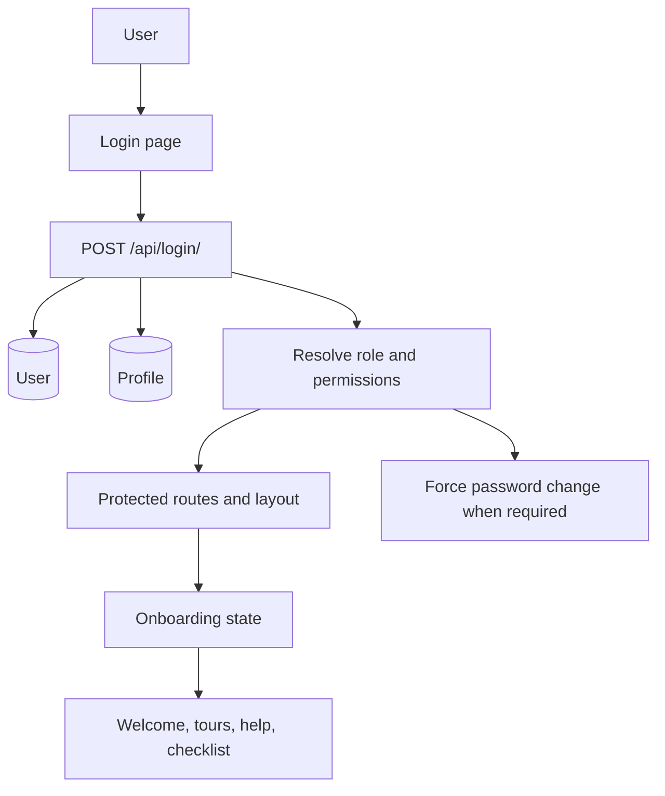

---

## 3. User, Teacher, Student, And Parent Management

### Workflow Summary

1. Admin creates or manages user accounts.
2. Profiles store role-specific details such as LRN, employee ID, contact info, and linked students.
3. Teachers can be assigned to classrooms and classroom subjects.
4. Parents can be linked to students through profile links and enrollment flows.
5. User status, approval, verification, mute, and suspension state affect system access.

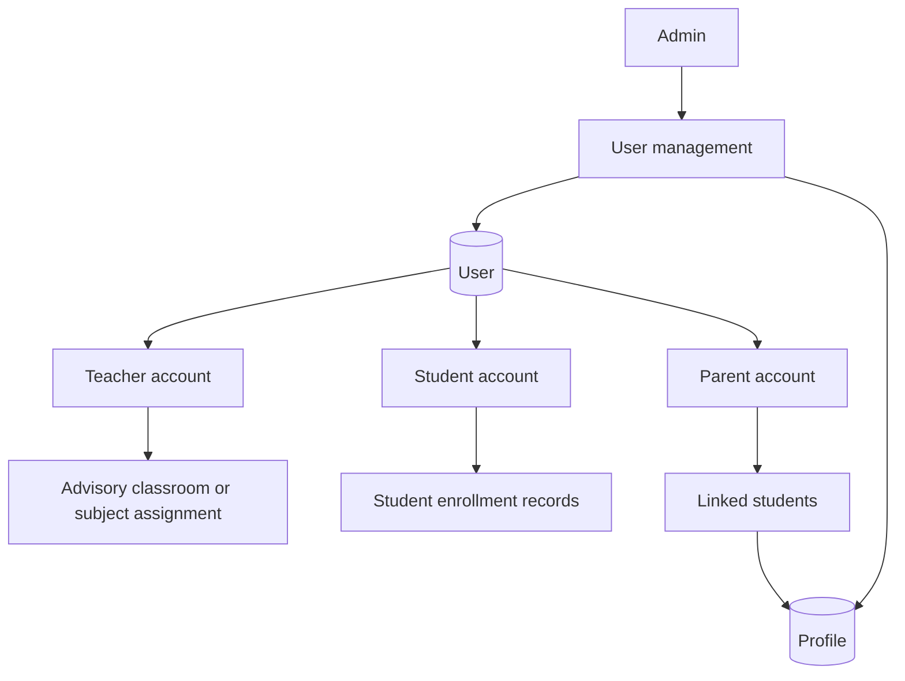

---

## 4. Enrollment And Admissions

### Workflow Summary

1. Applicant submits the online enrollment form from the public site.
2. Uploaded requirements are stored as application documents.
3. Admin opens the application, which can move from pending to under review.
4. Admin verifies or rejects documents, requests missing requirements, assigns a section, and approves or rejects the application.
5. When approved, admin enrolls the student, generates credentials, optionally links a parent, and assigns a classroom.
6. Status history records each transition until the application becomes enrolled.

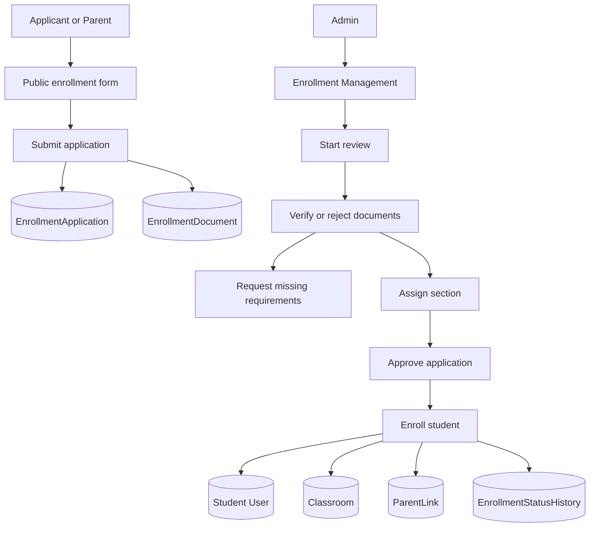

---

## 5. Academic Setup, Classrooms, And Subject Assignment

### Workflow Summary

1. Admin creates academic years and semesters.
2. Admin creates classrooms and assigns advisory teachers.
3. Admin creates subjects by grade level.
4. Admin maps subjects to classrooms and assigns teachers through `ClassroomSubject`.
5. Student enrollment records connect students to classrooms.
6. These structures feed attendance, grades, materials, assignments, schedules, and parent views.

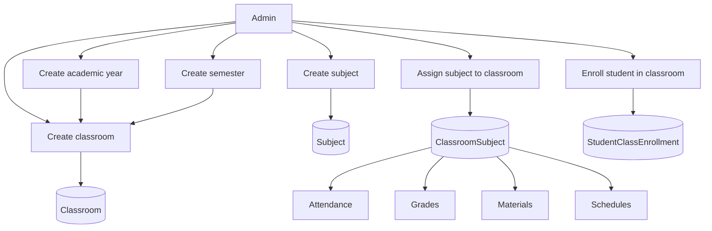

---

## 6. Attendance

### Workflow Summary

1. Teacher or admin opens the attendance module for a classroom.
2. The class roster is derived from student classroom enrollments.
3. Attendance is marked per student and date.
4. Records are stored in `Attendance`.
5. Summaries feed analytics and can be viewed by teachers, students, and linked parents.
6. Attendance actions can also contribute to audit history and notifications.

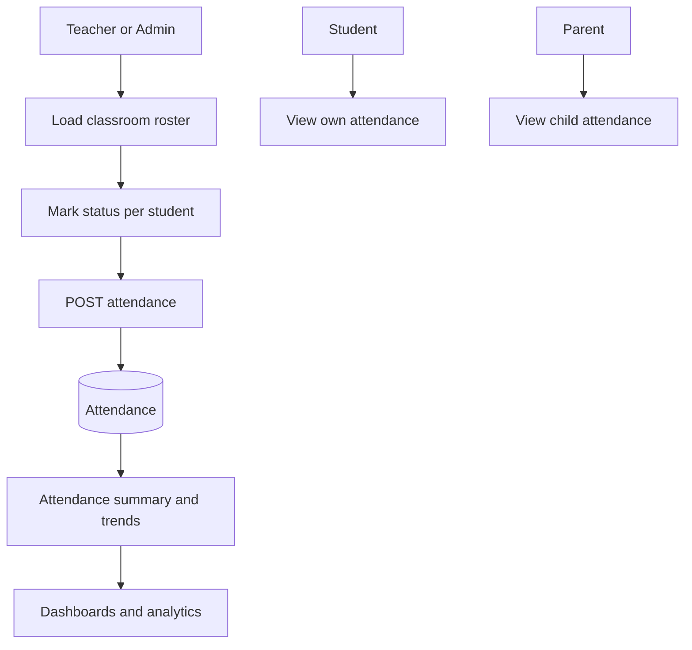

---

## 7. Grades And Reports

### Workflow Summary

1. Teacher selects classroom, subject, student, quarter, and grade type.
2. Grade entries are created or updated in `Grade`.
3. The system computes score fields and remarks.
4. Final grade entries support quarter summaries and report generation.
5. `GradeReport` computes averages, pass-fail counts, and overall remarks.
6. Students and parents can view finalized grades and reports.

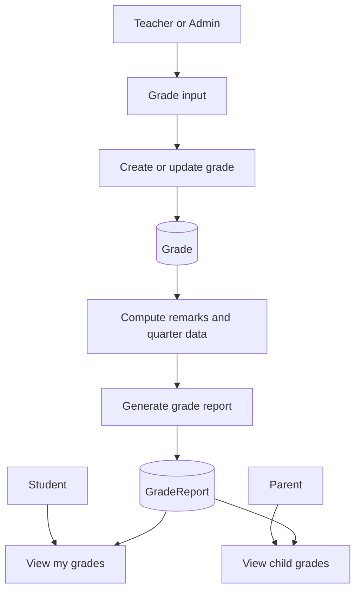

---

## 8. Learning Materials, Assignments, And Submissions

### Workflow Summary

1. Teacher or admin uploads learning materials for a classroom.
2. Material files are stored remotely and metadata is saved in `LearningMaterial`.
3. Teacher creates assignments with due dates, classroom, subject, and optional files.
4. Students submit work, which creates `Submission` records.
5. The system flags late submissions based on due date.
6. Teachers review submissions, add grades or feedback, and students can revisit results.

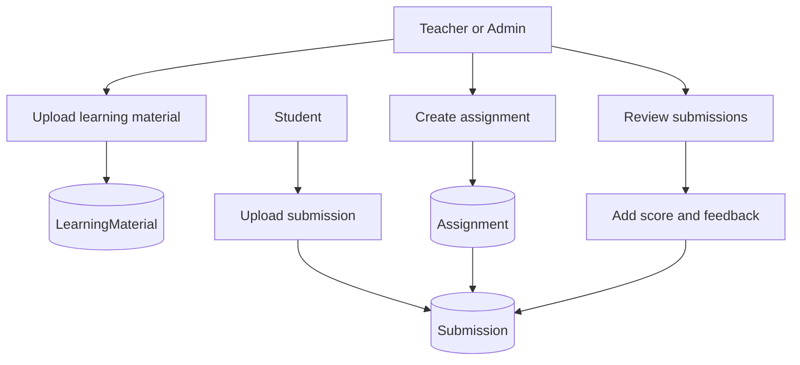

---

## 9. Scheduling And Calendars

### Workflow Summary

1. Admin creates rooms and reusable time slots.
2. Admin creates schedule entries that combine classroom, subject, teacher, room, academic year, and semester.
3. Backend uniqueness rules prevent teacher, room, or classroom conflicts for the same time slot.
4. Teachers and students open their schedule views.
5. Parents can view the linked child schedule.
6. Calendar views surface events and portal schedule context.

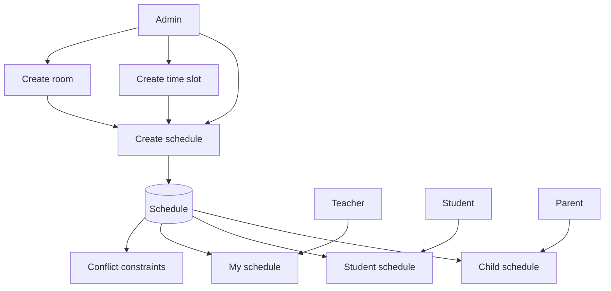

---

## 10. Announcements And Comments

### Workflow Summary

1. Admin or authorized staff creates an announcement.
2. Announcement can be saved as draft, published live, pinned, made public, or targeted by audience and classroom.
3. Attachments and event dates can be added.
4. Public visitors see public announcements on the website.
5. Logged-in users see portal announcements based on role and target audience.
6. Users can comment, and read state is tracked per user.

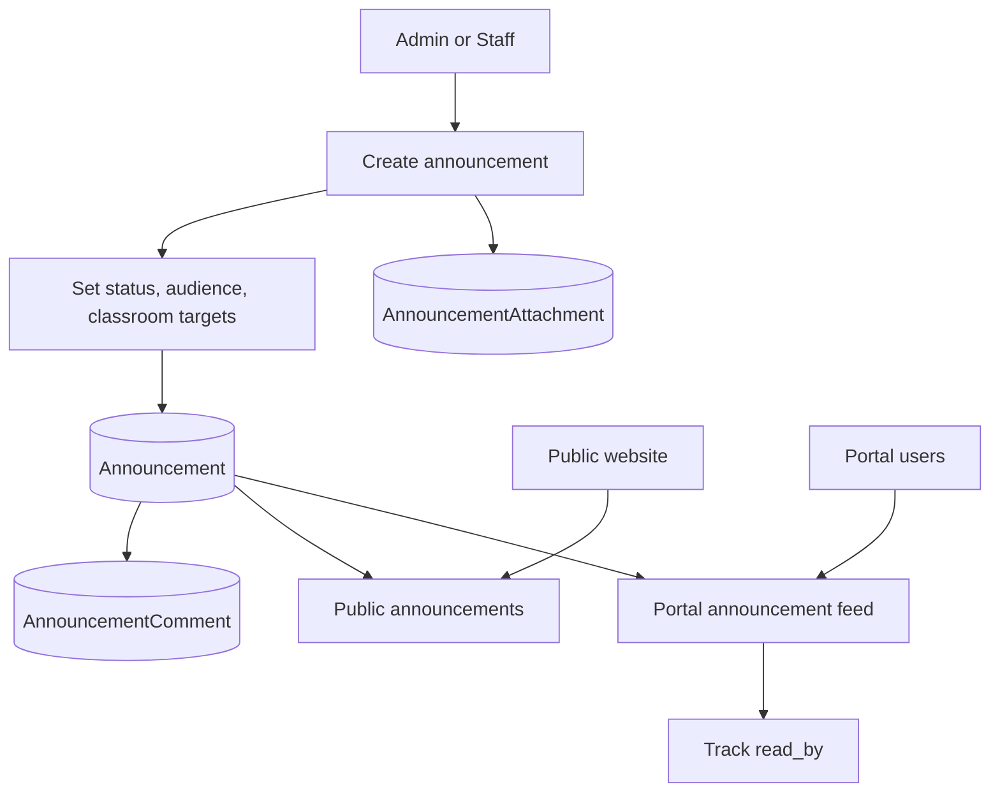

---

## 11. Notifications And Push Delivery

### Workflow Summary

1. System events such as announcements, grades, attendance, fees, messages, or friend requests create `Notification` records.
2. The backend broadcasts new notifications through realtime channels.
3. If web push is enabled, FCM tokens are used to send push notifications.
4. The frontend notification provider shows unread counts, dropdown previews, and the full notifications page.
5. Users mark single items or all items as read.
6. If realtime is unavailable, polling acts as fallback.

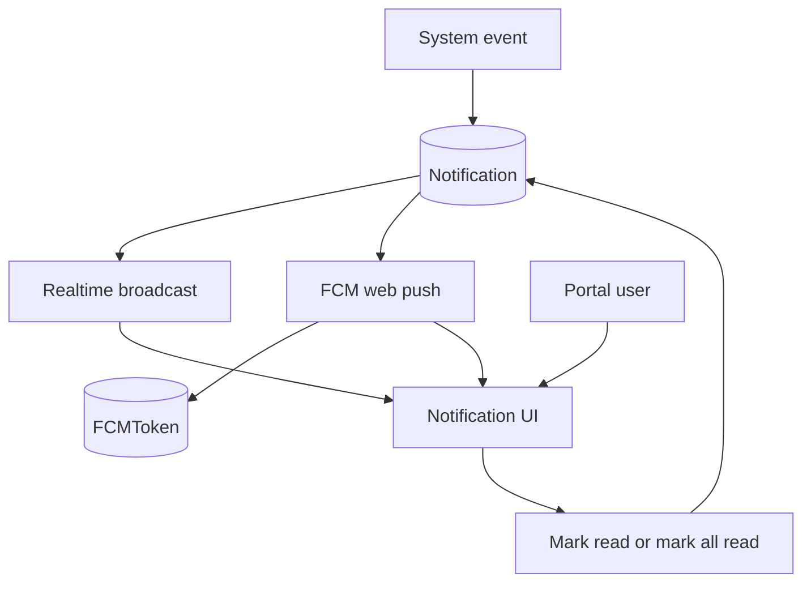

---

## 12. Messaging, Friendships, And Moderation

### Workflow Summary

1. Users create friendships or direct/group chat rooms.
2. Participants send text, image, or file messages.
3. Messages support delivery, read state, pinning, replies, edits, and reactions.
4. Reported content creates moderation cases in `ReportedMessage`.
5. Admin reviews reported messages, adds moderator notes, and resolves or dismisses cases.
6. Profile mute and suspension controls can restrict abusive users.

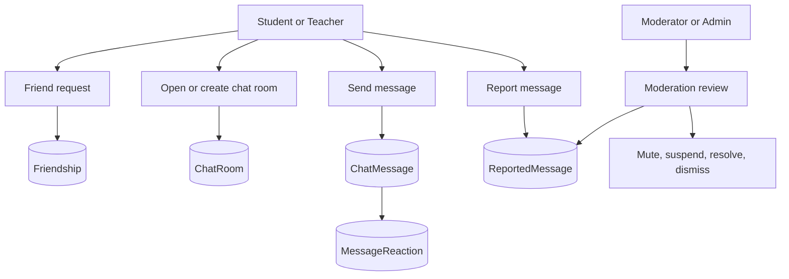

---

## 13. Parent Portal

### Workflow Summary

1. Parent signs in with a linked parent account.
2. Parent dashboard loads linked children.
3. Parent can open child-specific details for grades, attendance, schedules, and relevant announcements.
4. Parent also receives notifications and public or targeted school updates.
5. Parent account data can be maintained through profile and password settings.

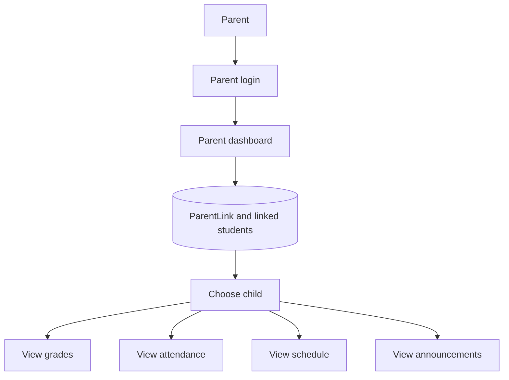

---

## 14. Settings, Maintenance Mode, And School Configuration

### Workflow Summary

1. Admin updates school identity, branding, and logo.
2. Admin manages academic years and default academic context.
3. Admin controls enrollment availability and chat permissions.
4. Admin can enable maintenance mode and set the maintenance message.
5. Frontend checks maintenance status on load and periodically afterward.
6. Non-admin users are redirected to the maintenance page while maintenance mode is active.

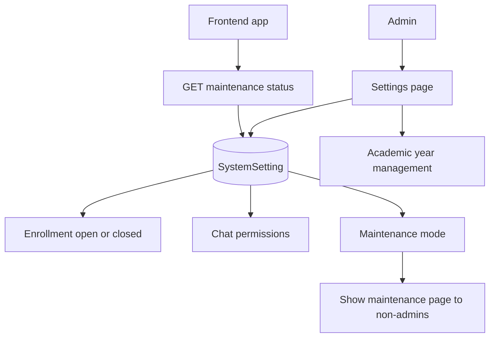

---

## 15. Audit Logs, Backups, Analytics, And System Health

### Workflow Summary

1. Important actions such as login, grade edits, attendance activity, moderation, and admin operations are recorded in audit logs.
2. Backup tools let admins trigger and manage database backup records.
3. API request logs and storage analytics support operational reporting.
4. Dashboard stats summarize activity for admins, teachers, students, and parents.
5. System health and metrics pages expose maintenance feed, storage, and service visibility for admins.

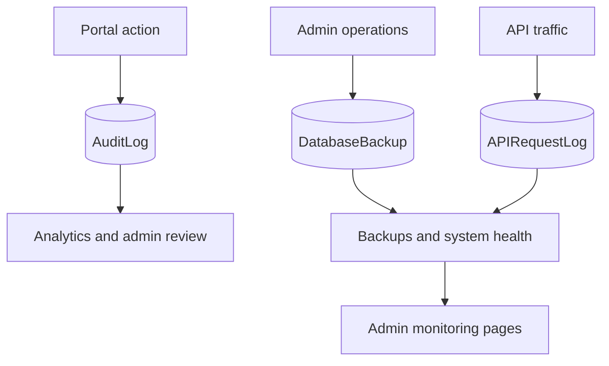

---

## Cross-System Dependency Flow

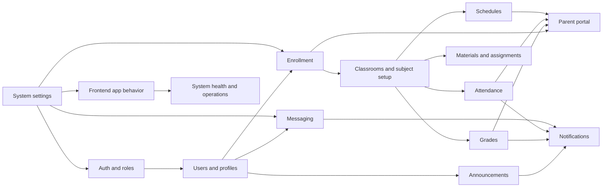

