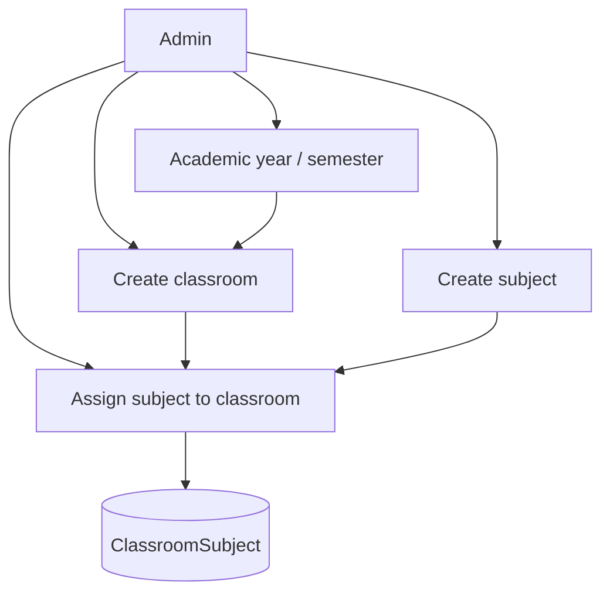
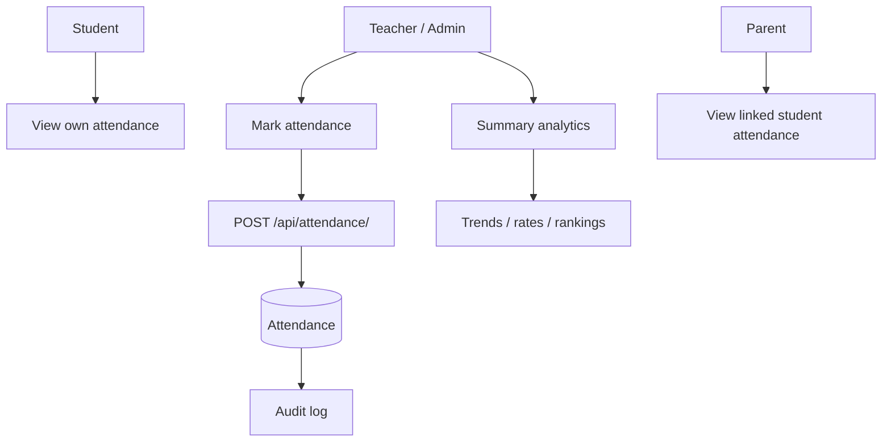
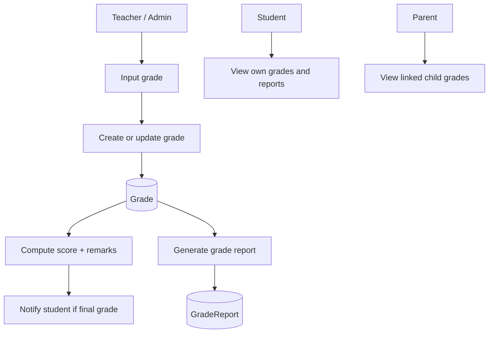
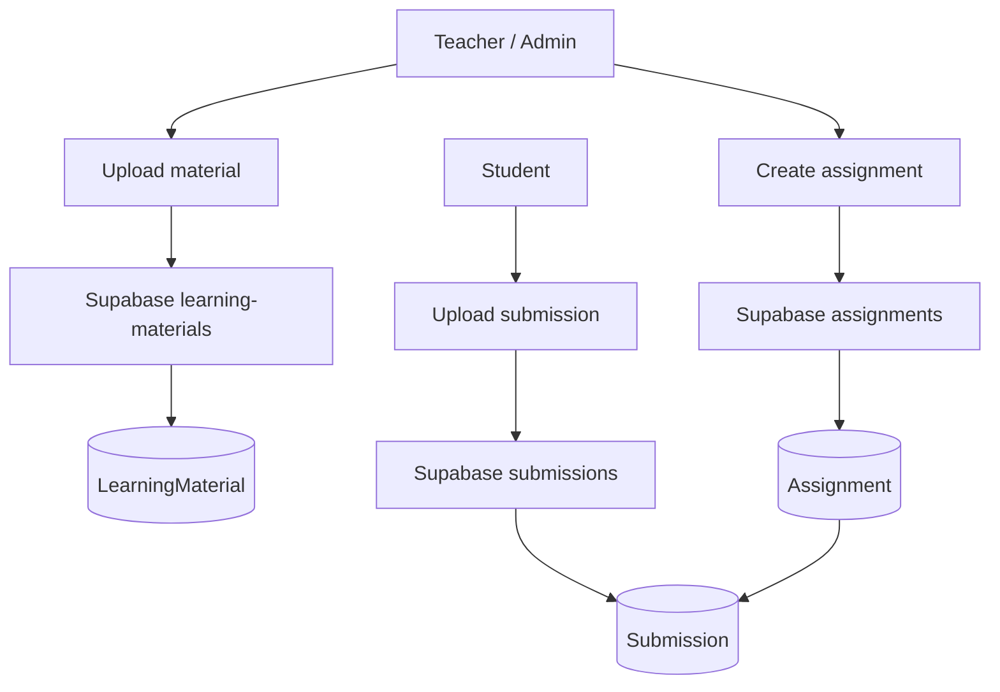
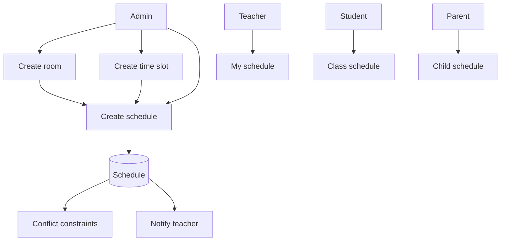

# Academic Module Workflows

## Classrooms And Subject Assignment

```mermaid
flowchart TD
    ADM[Admin] --> YEAR[Academic year / semester]
    ADM --> CLASS[Create classroom]
    ADM --> SUBJ[Create subject]
    ADM --> MAP[Assign subject to classroom]
    YEAR --> CLASS
    CLASS --> MAP
    SUBJ --> MAP
    MAP --> CS[(ClassroomSubject)]
```

## Attendance

```mermaid
flowchart TD
    TEA[Teacher / Admin] --> MARK[Mark attendance]
    MARK --> API[POST /api/attendance/]
    API --> DB[(Attendance)]
    DB --> AUDIT[Audit log]

    STU[Student] --> VIEW[View own attendance]
    PAR[Parent] --> VIEWP[View linked student attendance]
    TEA --> SUM[Summary analytics]
    SUM --> CHARTS[Trends / rates / rankings]
```

## Grades And Reports

```mermaid
flowchart TD
    TEA[Teacher / Admin] --> INPUT[Input grade]
    INPUT --> UPSERT[Create or update grade]
    UPSERT --> GRADE[(Grade)]
    GRADE --> CALC[Compute score + remarks]
    CALC --> NOTIF[Notify student if final grade]
    GRADE --> REPORT[Generate grade report]
    REPORT --> REP[(GradeReport)]

    STU[Student] --> MYG[View own grades and reports]
    PAR[Parent] --> CHILD[View linked child grades]
```

## Materials, Assignments, And Submissions

```mermaid
flowchart TD
    TEA[Teacher / Admin] --> MAT[Upload material]
    MAT --> SUPA1[Supabase learning-materials]
    SUPA1 --> MATDB[(LearningMaterial)]

    TEA --> ASG[Create assignment]
    ASG --> SUPA2[Supabase assignments]
    SUPA2 --> ASGDB[(Assignment)]

    STU[Student] --> SUBMIT[Upload submission]
    SUBMIT --> SUPA3[Supabase submissions]
    SUPA3 --> SUBDB[(Submission)]

    ASGDB --> SUBDB
```

## Scheduling

```mermaid
flowchart TD
    ADM[Admin] --> ROOM[Create room]
    ADM --> SLOT[Create time slot]
    ADM --> SCHED[Create schedule]
    ROOM --> SCHED
    SLOT --> SCHED
    SCHED --> DB[(Schedule)]
    DB --> CHECK[Conflict constraints]
    DB --> NOTIF[Notify teacher]

    TEA[Teacher] --> MYS[My schedule]
    STU[Student] --> CLS[Class schedule]
    PAR[Parent] --> CHS[Child schedule]
```
