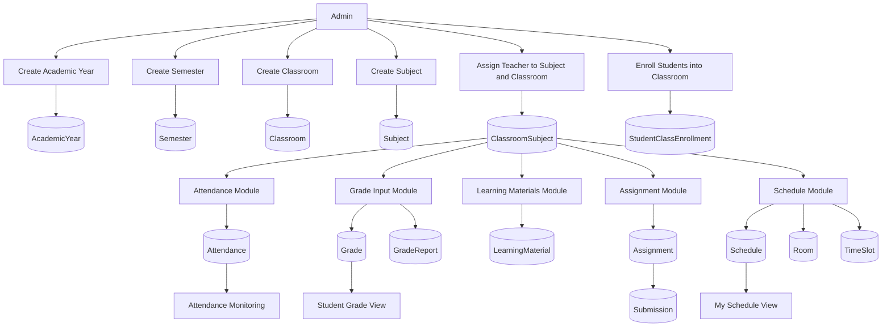

# Research Paper Academic Module Workflow Visual

## Figure Title

**Figure 5. Academic Module Workflow**

## Mermaid Diagram

## Main Parts

- Academic setup
- Classroom and subject configuration
- Teacher assignment
- Student enrollment
- Attendance, grade, material, assignment, and schedule execution

## Caption

This figure shows the academic workflow of the school portal, beginning with the creation of academic structures such as year, semester, classroom, and subject, then continuing into teacher assignment, student enrollment, attendance tracking, grade processing, materials distribution, assignment handling, and scheduling.

