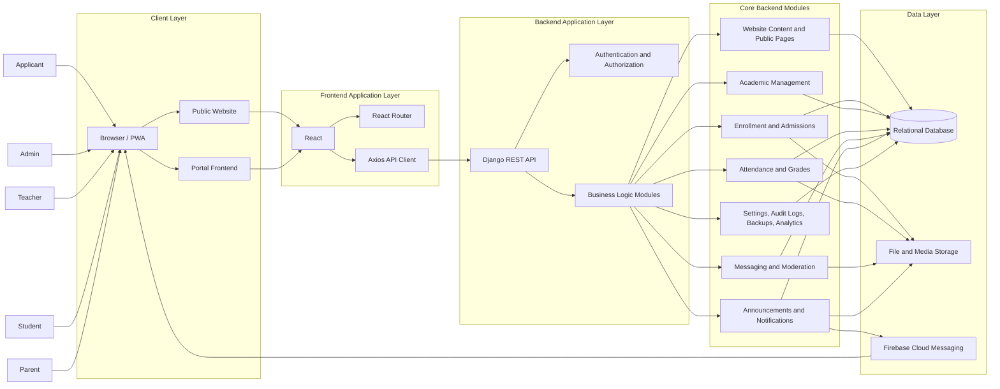

# Research Paper Architecture Diagram

## Figure Title

**Figure 1. Overall System Architecture of the School Web Application**

## Mermaid Diagram

## Main Parts

- Client layer
- Frontend application layer
- Backend API layer
- Core backend modules
- Data and external service layer

## Caption

This figure shows how applicants, administrators, teachers, students, and parents access the React frontend through a browser or PWA, which communicates with the Django REST backend. The backend processes academic, communication, admissions, and system-management features while storing records in the database, files in storage, and push alerts through Firebase Cloud Messaging.

