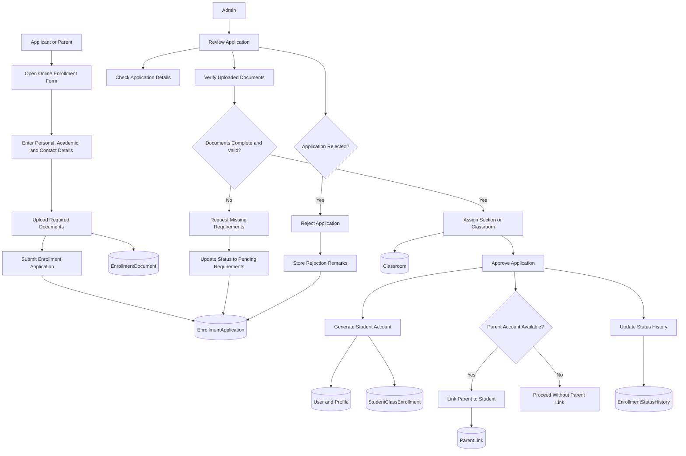

# Research Paper Enrollment Workflow Visual

## Figure Title

**Figure 4. Enrollment and Admissions Workflow**

## Mermaid Diagram

## Main Parts

- Applicant submission stage
- Document upload stage
- Admin review stage
- Approval or rejection stage
- Student account creation stage
- Parent linking stage

## Caption

This figure illustrates the enrollment and admissions process of the system, beginning with applicant submission and document upload, then proceeding through administrative review, classroom assignment, approval or rejection, student account creation, and optional parent linkage.

