# Research Paper ERD

## Figure Title

**Figure 3. Entity Relationship Diagram of the School Web Application**

## Mermaid Diagram

```mermaid
erDiagram
    User {
        int id
        string username
        string email
        string role
        boolean is_verified
        boolean is_approved
        string account_status
    }

    Profile {
        int id
        string lrn
        string grade_level
        string employee_id
        string phone_number
        string registration_number
        string profile_picture
    }

    AcademicYear {
        int id
        string name
        date start_date
        date end_date
        boolean is_active
    }

    Semester {
        int id
        string semester_type
        date start_date
        date end_date
        boolean is_active
    }

    Classroom {
        int id
        string name
        string grade_level
        int capacity
    }

    Subject {
        int id
        string name
        string code
        string grade_level
    }

    ClassroomSubject {
        int id
        decimal ww_weight
        decimal pt_weight
        decimal qa_weight
        datetime assigned_at
    }

    StudentClassEnrollment {
        int id
        int q1
        int q2
        int q3
        int q4
        decimal gpa
    }

    Attendance {
        int id
        date date
        string status
        string remarks
    }

    Grade {
        int id
        string grade_type
        int quarter
        decimal raw_score
        decimal final_grade
        string academic_year
        boolean is_locked
    }

    GradeReport {
        int id
        int quarter
        string school_year
        decimal general_average
        int total_subjects
        int passed_subjects
        int failed_subjects
        boolean is_final
    }

    LearningMaterial {
        int id
        string title
        string material_type
        string file
        int quarter
        int week
    }

    Assignment {
        int id
        string title
        datetime due_date
        int points
        string file
    }

    Submission {
        int id
        string file
        datetime submitted_at
        int grade
        string feedback
        boolean is_late
    }

    Room {
        int id
        string name
        string building
        int capacity
        string room_type
    }

    TimeSlot {
        int id
        string day
        time start_time
        time end_time
        string label
    }

    Schedule {
        int id
        boolean is_active
        string notes
    }

    Announcement {
        int id
        string title
        string category
        string status
        string target_audience
        boolean is_public
        boolean is_pinned
    }

    AnnouncementAttachment {
        int id
        string filename
        string file
        string content_type
    }

    AnnouncementComment {
        int id
        string content
        datetime created_at
    }

    Notification {
        int id
        string notification_type
        string title
        string message
        boolean is_read
        string link
    }

    ChatRoom {
        int id
        string name
        boolean is_group
        datetime created_at
    }

    ChatMessage {
        int id
        string content
        string message_type
        string attachment_url
        boolean is_read
        boolean is_pinned
        boolean is_edited
    }

    MessageReaction {
        int id
        string emoji
        datetime created_at
    }

    ReportedMessage {
        int id
        string reason
        string status
        string moderator_note
        datetime created_at
    }

    Friendship {
        int id
        string status
        datetime created_at
    }

    EnrollmentApplication {
        int id
        string enrollment_number
        string enrollment_type
        string school_year
        string grade_level
        string strand
        string status
        string email
    }

    EnrollmentDocument {
        int id
        string document_type
        string file_url
        string verification_status
    }

    EnrollmentStatusHistory {
        int id
        string from_status
        string to_status
        string notes
        datetime created_at
    }

    ParentLink {
        int id
        string relationship
        boolean is_primary
    }

    WebsiteContent {
        int id
        string section
        string category
        string content
        string image
    }

    SystemSetting {
        int id
        string site_name
        boolean maintenance_mode
        boolean enrollment_open
        string current_quarter
        string academic_year
    }

    AuditLog {
        int id
        string action
        string action_type
        string model_name
        string description
        datetime timestamp
    }

    DatabaseBackup {
        int id
        string filename
        string size
        datetime created_at
    }

    APIRequestLog {
        int id
        string endpoint
        string method
        int status_code
        float response_time_ms
        datetime timestamp
    }

    User ||--|| Profile : has
    AcademicYear ||--o{ Semester : contains
    AcademicYear ||--o{ Classroom : organizes
    Semester ||--o{ Classroom : groups
    User o|--o{ Classroom : advises

    Classroom ||--o{ ClassroomSubject : has
    Subject ||--o{ ClassroomSubject : assigned_to
    User ||--o{ ClassroomSubject : teaches

    User ||--o{ StudentClassEnrollment : enrolls
    Classroom ||--o{ StudentClassEnrollment : contains

    User ||--o{ Attendance : has
    Classroom ||--o{ Attendance : records
    User ||--o{ Attendance : marks

    User ||--o{ Grade : receives
    Subject ||--o{ Grade : evaluates
    Classroom ||--o{ Grade : groups
    User ||--o{ Grade : encodes

    User ||--o{ GradeReport : receives
    Classroom ||--o{ GradeReport : summarizes
    User o|--o{ GradeReport : generates

    Classroom ||--o{ LearningMaterial : contains
    User ||--o{ LearningMaterial : uploads

    Classroom ||--o{ Assignment : has
    Subject ||--o{ Assignment : under
    User ||--o{ Assignment : creates
    Assignment ||--o{ Submission : receives
    User ||--o{ Submission : submits

    Classroom ||--o{ Schedule : follows
    Subject ||--o{ Schedule : schedules
    User ||--o{ Schedule : teaches
    Room ||--o{ Schedule : hosts
    TimeSlot ||--o{ Schedule : uses
    AcademicYear ||--o{ Schedule : controls
    Semester o|--o{ Schedule : narrows

    User ||--o{ Announcement : authors
    Announcement ||--o{ AnnouncementAttachment : has
    Announcement ||--o{ AnnouncementComment : receives
    User ||--o{ AnnouncementComment : writes

    User ||--o{ Notification : receives

    ChatRoom ||--o{ ChatMessage : contains
    User ||--o{ ChatMessage : sends
    ChatMessage ||--o{ MessageReaction : gets
    User ||--o{ MessageReaction : gives
    ChatMessage o|--o{ ReportedMessage : produces
    User ||--o{ ReportedMessage : reports
    User ||--o{ Friendship : initiates

    EnrollmentApplication ||--o{ EnrollmentDocument : includes
    EnrollmentApplication ||--o{ EnrollmentStatusHistory : tracks
    EnrollmentApplication ||--o{ ParentLink : creates
    User o|--o{ ParentLink : parent
    User o|--o{ ParentLink : student
    User o|--o{ EnrollmentApplication : becomes
    Classroom o|--o{ EnrollmentApplication : assigns

    User o|--o{ WebsiteContent : updates
    User o|--o{ AuditLog : performs
    User o|--o{ DatabaseBackup : creates
    User o|--o{ APIRequestLog : requests
```

## Main Parts

- Identity models
- Academic structure models
- Academic operation models
- Communication models
- Admissions models
- System and governance models

## Caption

This figure presents the core entities and relationships of the school web application database. It highlights the connections between user accounts, academic structures, learning operations, communication features, admissions workflows, and system-management records.

