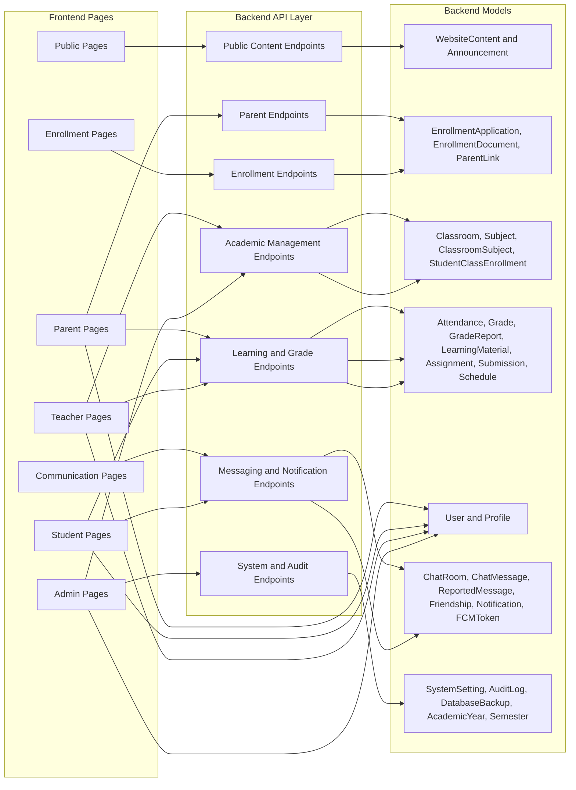

# Research Paper Frontend-Page-to-Backend-Model Mapping Visual

## Figure Title

**Figure 8. Frontend Page to Backend Model Mapping**

## Mermaid Diagram

## Main Parts

- Frontend page groups
- Backend endpoint groups
- Backend model groups
- Flow from UI to API to data layer

## Caption

This figure shows how groups of frontend pages connect to backend endpoints and finally to the backend model groups that store and manage the application data.

