# Research Paper Full Model Visual

## Figure Title

**Figure 9. Full Model Relationship Visual**

## Mermaid Diagram

```mermaid
flowchart TD
    subgraph IDENTITY["Identity and Access Models"]
        A[User]
        B[Profile]
        C[OnboardingState]
        D[OTP]
    end

    subgraph ACADEMIC["Academic Structure Models"]
        E[AcademicYear]
        F[Semester]
        G[Classroom]
        H[Subject]
        I[ClassroomSubject]
        J[StudentClassEnrollment]
    end

    subgraph LEARNING["Learning Operation Models"]
        K[Attendance]
        L[Grade]
        M[GradeReport]
        N[LearningMaterial]
        O[Assignment]
        P[Submission]
        Q[Room]
        R[TimeSlot]
        S[Schedule]
    end

    subgraph COMM["Communication Models"]
        T[Announcement]
        U[AnnouncementAttachment]
        V[AnnouncementComment]
        W[Notification]
        X[FCMToken]
        Y[ChatRoom]
        Z[ChatMessage]
        AA[MessageReaction]
        AB[ReportedMessage]
        AC[Friendship]
    end

    subgraph ADMISSION["Admissions and Parent Models"]
        AD[EnrollmentApplication]
        AE[EnrollmentDocument]
        AF[EnrollmentStatusHistory]
        AG[ParentLink]
    end

    subgraph SYSTEM["System and Governance Models"]
        AH[WebsiteContent]
        AI[SystemSetting]
        AJ[AuditLog]
        AK[DatabaseBackup]
        AL[APIRequestLog]
    end

    A --> B
    A --> C
    A --> D

    E --> F
    E --> G
    F --> G
    G --> I
    H --> I
    A --> I
    A --> J
    G --> J

    G --> K
    A --> K
    G --> L
    H --> L
    A --> L
    G --> M
    A --> M

    G --> N
    A --> N
    G --> O
    H --> O
    A --> O
    O --> P
    A --> P

    G --> S
    H --> S
    A --> S
    Q --> S
    R --> S
    E --> S
    F --> S

    A --> T
    T --> U
    T --> V
    A --> V
    A --> W
    A --> X

    Y --> Z
    A --> Z
    Z --> AA
    Z --> AB
    A --> AB
    A --> AC

    AD --> AE
    AD --> AF
    AD --> AG
    A --> AG
    G --> AD
    A --> AD

    A --> AH
    AI --> T
    AI --> W
    AI --> AD
    A --> AJ
    A --> AK
    A --> AL
```

## Main Parts

- Identity and access models
- Academic structure models
- Learning operation models
- Communication models
- Admissions and parent models
- System and governance models

## Caption

This figure provides a grouped visual overview of the system’s full model structure. Instead of focusing on raw table detail, it highlights how the major backend models are organized into domains and how those domains connect throughout the application.

