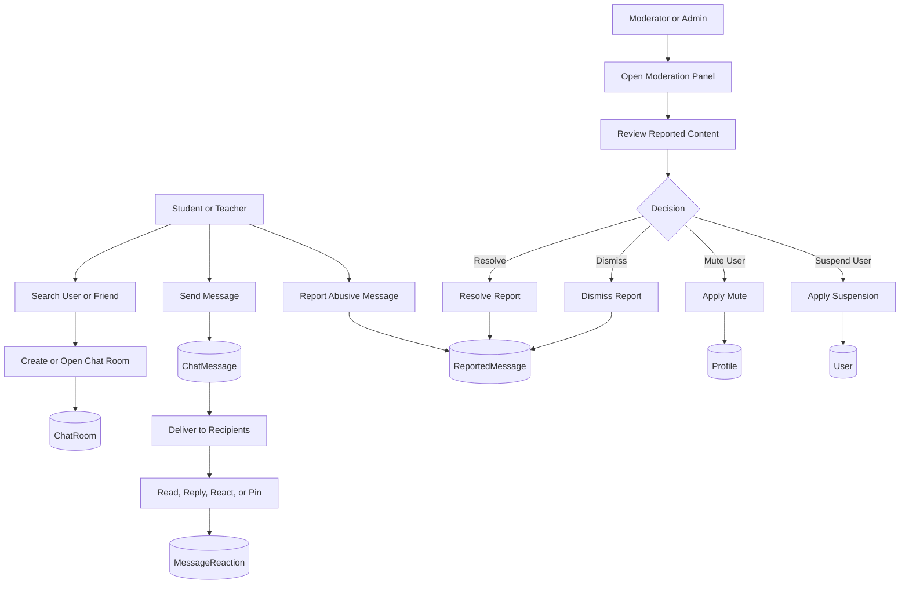

# Research Paper Messaging and Moderation Workflow Visual

## Figure Title

**Figure 6. Messaging and Moderation Workflow**

## Mermaid Diagram

## Main Parts

- User messaging flow
- Chat room creation and usage
- Message interaction features
- Report submission
- Moderator review and action flow

## Caption

This figure presents the messaging and moderation workflow of the portal. It covers user messaging, room creation, reactions and replies, abuse reporting, moderator review, and corrective actions such as resolving reports, muting users, and suspending accounts.

