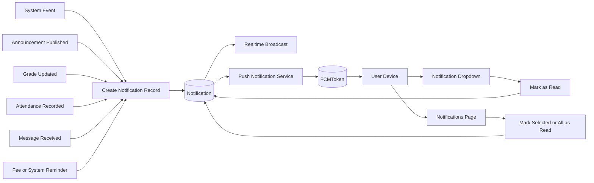

# Research Paper Notification and Push Flow Visual

## Figure Title

**Figure 7. Notification and Push Delivery Flow**

## Mermaid Diagram

## Main Parts

- Event source
- Notification creation
- Realtime broadcast
- Push delivery through FCM
- User read and acknowledgement flow

## Caption

This figure illustrates how system events generate notifications, how those notifications are delivered through realtime broadcast and Firebase push services, and how users access and mark them as read through the portal interface.

