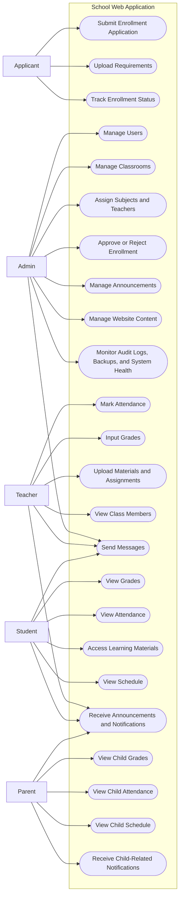

# Research Paper Use Case Diagram

## Figure Title

**Figure 2. Use Case Diagram of the School Web Application**

## Mermaid Diagram

## Main Parts

- Applicant use cases
- Admin use cases
- Teacher use cases
- Student use cases
- Parent use cases

## Caption

This figure presents the primary user roles of the system and the major functions available to each actor. It highlights how the platform supports admissions, academic management, communication, monitoring, and parent visibility within one integrated school web application.

